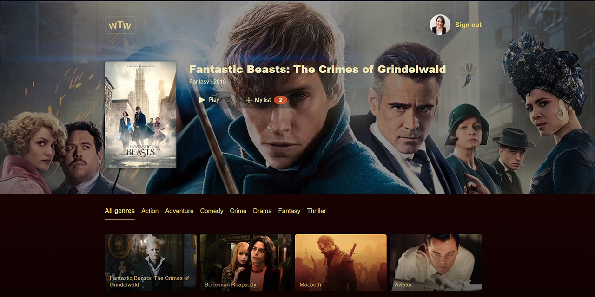

# Проект «Что посмотреть» от [HTML Academy](https://htmlacademy.ru/)

Онлайн кинотеатр нового поколения. Смотрите новинки абсолютно бесплатно и в лучшем качестве. Оставляйте отзывы, ставьте оценки и выбирайте только лучшее из мира большого кино.

Программирование: [Андрей Грачев](https://github.com/andreysgra/)

[Демо проекта](https://what-to-watch-cinema.vercel.app/)

[Техническое задание](Specification.md)

## Используемый стек

React, TypeScript, React Router, Redux, Axios, Redux Toolkit.

## Как использовать

`npm install` – установка зависимостей.

`npm start` – запуск проекта в режиме разработки.

`npm run lint` – проверка проекта с помощью **ESLint**.

`npm run build` – финальная сборка проекта.

`npm run preview` – запуск финальной сборки проекта.

